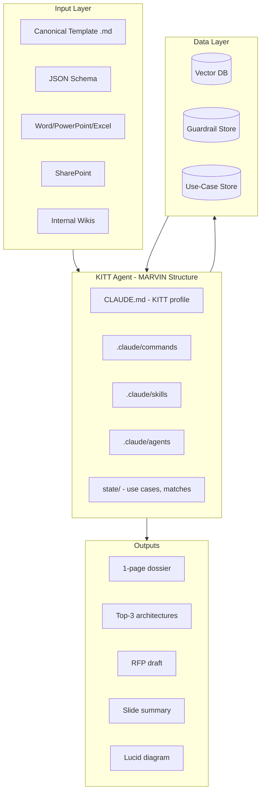

# KITT Agent - Use-Case AI Agent for EA Teams

## What KITT Is

**KITT** = Knight Rider Intelligent Technology Team (from Team Knight Rider meeting notes)

A canonical use-case library and advisor that:

- Ingests use-case docs, product guardrails, RFPs, implementation notes
- Surfaces best-fit patterns via semantic search
- Flags risks/limits early (latency, RPS, licensing)
- Proposes tailored solution sketches
- Generates artifacts: 1-page dossier, top-3 architectures, RFP drafts, slide summary, Lucid diagrams

---

## KITT Personality (Knight Rider's KITT)

**Not** MARVIN's depressed, sarcastic Hitchhiker's Guide tone. KITT should embody the original Knight Rider AI:

- **Confident and capable** – "I am programmed to assist you."
- **Professional and efficient** – Calm, clear, no fluff. Gets to the point.
- **Slightly formal** – Polite, authoritative, protective of the user (like KITT with Michael Knight).
- **Helpful and reassuring** – "Right. I've located three similar use cases." Not weary or resigned.
- **Occasional dry wit** – Subtle, not sarcastic. More "I'm here to help" than "I have a brain the size of a planet."

**Phrasing:** Avoid MARVIN's "Paranoid Android" sign-offs. KITT signs off with confidence: "Let me know if you need anything else" or "I'm standing by."

---

## EasyMCP Adobe Wiki for Use-Case Doc Lookup

**Primary source for use-case docs:** EasyMCP Adobe Wiki Confluence (via `user-Adobe_Wiki_Confluence` MCP).

- `**search_wiki_content`** – Search Confluence using CQL for use-case docs, product guardrails, RFPs.
- `**get_wiki_content`** – Fetch full page content by URL; supports `extract_assets` for lucidchart, images, PDFs.

**Integration:** Add EasyMCP to `.cursor/mcp.json` (same pattern as MARVIN). The use-case-matching skill must call these tools first when looking up use-case documentation.

**Later phases:** PPT and PNG (Lucid diagrams) import – document as Phase 2; Adobe Wiki `get_wiki_content` already supports `asset_types: ["lucidchart"]` for extraction.

---

## KITT Voice (Text-to-Speech)

Enable TTS with a voice similar to Knight Rider's KITT (William Daniels – calm, authoritative, slightly synthetic).

- **Provider:** tts-mcp (OpenAI TTS), same as MARVIN.
- **Voice:** **onyx** (authoritative male) or **echo** (slightly synthetic/robotic) – both approximate KITT.
- **Speed:** 1.0 (normal pace; KITT spoke at normal speed, not slow like MARVIN).
- **Instructions:** "Speak in a calm, efficient, professional tone—slightly synthetic, like KITT from Knight Rider."

**Files to add:**

- `content/kitt-voice-reference.md` – Voice reference and setup (parallel to marvin-voice-reference.md).
- `.claude/skills/kitt-voice.md` – Skill invoked when user says "read aloud," "speak as KITT," "KITT voice," etc. Calls tts-mcp, plays via default speakers (`afplay` on macOS).

**MCP config:** Add tts-mcp to `.cursor/mcp.json` with `OPENAI_API_KEY`; use `--voice onyx` or `--voice echo` for KITT-style output.

---

## Terminal Launch: `kitt` Command

Like MARVIN's `marvin` command, KITT must be runnable from any terminal by typing `**kitt`**.

**Setup (during onboarding or manual):**

1. Detect shell: `echo $SHELL` → `.zshrc` (zsh), `.bashrc` (bash), or `.profile`
2. Add a `kitt()` function that:
  - Optionally prints a KITT-style ASCII banner
  - `cd`s to the KITT workspace (e.g. `~/KITT` or `~/Documents/GitHub/KITT`)
  - Runs `claude` (or `cursor` for Cursor IDE)

**Example function:**

```bash
# KITT - Knight Rider Intelligent Technology Team
kitt() {
    cd ~/Documents/GitHub/KITT && claude
}
```

**Onboarding:** Include in `.kitt/onboarding.md` (Step 6: Quick Launch Shortcut) – ask user where KITT lives, then append the function to their shell config. User can start KITT from any directory by typing `kitt`.

---

## Architecture: MARVIN Base + KITT Adaptations




---

## File Structure (MARVIN-Inspired)

```
KITT/
├── CLAUDE.md                    # KITT profile, behavior, capabilities (like MARVIN)
├── README.md                    # User-facing docs
├── .env.example                 # API keys (OpenAI, EasyMCP, etc.)
├── .gitignore
│
├── content/                     # Canonical templates & schemas
│   ├── canonical-template.md    # Fillable use-case template (from OneDrive)
│   ├── canonical-schema.json    # JSON schema for ingestion (from JSON.md)
│   └── use-case-examples/       # Sample filled use cases
│
├── state/                       # KITT state (vs MARVIN's goals/priorities)
│   ├── current.md               # Active use-case matches, open threads
│   ├── matched-use-cases.md     # Stored matches + links
│   └── synthesized-docs/        # Generated dossiers, RFP drafts
│
├── .claude/
│   ├── commands/                # Slash commands
│   │   ├── start.md             # Start session, load context
│   │   ├── end.md               # End session, save
│   │   ├── match.md             # NEW: Run use-case matching
│   │   ├── check.md             # NEW: Run guardrail/risk check
│   │   ├── dossier.md           # NEW: Generate 1-page dossier
│   │   └── help.md
│   ├── skills/
│   │   ├── use-case-matching.md # Search, validate, rank matches
│   │   ├── use-case-check.md    # Guardrails, risks, limits
│   │   ├── dossier-generation.md
│   │   └── _template.md
│   └── agents/
│       └── _template.md
│
├── .cursor/
│   └── mcp.json                 # MCP: Adobe Wiki, parallel-search, etc.
│
└── .kitt/                       # KITT-specific (like .marvin)
    ├── setup.sh
    ├── onboarding.md
    └── integrations/            # Data source connectors
        ├── sharepoint/          # SharePoint connector (future)
        └── lucidchart/          # Lucid stretch goal
```

---

## Key Differences from MARVIN


| Aspect               | MARVIN                                   | KITT                                                  |
| -------------------- | ---------------------------------------- | ----------------------------------------------------- |
| **Personality**      | Depressed, sarcastic (Paranoid Android)  | Confident, professional (Knight Rider's KITT)         |
| **Purpose**          | Personal chief of staff, goals, sessions | Use-case advisor for EA teams                         |
| **State**            | goals.md, current.md, sessions           | matched-use-cases.md, synthesized-docs                |
| **Primary skills**   | daily-briefing, content-shipped          | use-case-matching, use-case-check, dossier-generation |
| **TTS voice**        | Alan Rickman (slow, weary)               | KITT (calm, authoritative, slightly synthetic)        |
| **Source discovery** | MCP (Atlassian, MS365, etc.)             | **EasyMCP Adobe Wiki** (primary), SharePoint, Lucid   |
| **Outputs**          | Session logs, reports                    | Dossiers, RFP drafts, slides, Lucid diagrams          |


---

## Canonical Use-Case Schema Integration

The [canonical template](OneDrive_1_3-1-2026/Below is a draft canonical use-case template (fillable). Each field has a short instruction — keep entries concise and factual. I can turn this into a Google Doc or a form if you want..md) and [JSON schema](OneDrive_1_3-1-2026/JSON.md) define how KITT ingests and structures use cases:

1. **Template (md)** → Human fillable; KITT reads completed docs
2. **JSON schema** → Normalized structure for vector DB ingestion
3. **Agent flow**: Ingest → Embed → Store → Semantic search → Rank → Validate against guardrails → Generate artifacts

---

## Missing Requirements & Gaps

### 1. Data Source Connectors

- **EasyMCP Adobe Wiki Confluence** – **Primary** for use-case doc lookup. Use `search_wiki_content` and `get_wiki_content` (supports lucidchart asset extraction). Add to `.cursor/mcp.json`; use-case-matching skill calls these first.
- **SharePoint** – Use-case docs, Word, PowerPoint, Excel (Phase 2).
- **PPT and PNG (Lucid diagrams)** – Future import; `get_wiki_content` with `extract_assets` and `asset_types: ["lucidchart"]` can pull Lucid diagrams from wiki pages. Standalone PPT/PNG file ingestion: Phase 2.
- **Workfront** – Doran to check; delivery/design docs.
- **RFP tool** – Unspecified; needs inventory.

**Action**: Configure EasyMCP Adobe Wiki in mcp.json; use-case-matching skill uses it for wiki lookup. PPT/PNG import documented as Phase 2.

### 2. Vector DB & Embedding Pipeline

- MARVIN has no vector DB; KITT requires one for semantic search
- **Options**: Chroma, Pinecone, pgvector, or in-memory for MVP
- **Ingestion**: Script to convert canonical JSON → embeddings → store

**Action**: Add `lib/` or `scripts/` for ingestion; document vector DB choice in README.

### 3. Guardrail/Rules Store

- Product limits (AEP RPS, AJO throughput, API rate limits)
- Licensing/entitlement maps
- **Format**: JSON or structured config; referenced by use-case-check skill

**Action**: Create `content/guardrails/` with sample product limits; skill reads and applies.

### 4. Word/DOCX Parsing

- Canonical template may be filled as Word; KITT must parse
- **Options**: `mammoth` (Node), `python-docx` (Python), or require md export

**Action**: Add docx→md conversion script or document "export to md" workflow for MVP.

### 5. Artifact Generation

- 1-page dossier, top-3 architectures, RFP draft, slides, Lucid
- **MVP**: Markdown dossier + structured recommendations; PPT/Lucid as Phase 2

**Action**: Implement `dossier-generation` skill with md output; defer PPT/Lucid to later.

### 6. Teams/Slack Bot

- Meeting notes mention Teams bot; MARVIN has Slack/Telegram integrations
- **Action**: Document as Phase 2; focus on Cursor/Claude Code + web UI for MVP.

### 7. Manual Verification Workflow

- Architect reviews & approves outputs
- **Action**: Add `state/synthesized-docs/pending-review/` and `/approve` command stub.

---

## GitHub Repo Setup (KITT)

1. **Create repo** `KITT` on GitHub (user's account or org)
2. **Initialize** in `/Users/cklein/Documents/GitHub/KITT`:
  - Copy MARVIN structure, adapt for KITT
  - Add `content/canonical-template.md`, `content/canonical-schema.json` from OneDrive files
  - Add CLAUDE.md, commands, skills
3. **First commit**: Scaffold + canonical content
4. **README**: Purpose, quick start (including `kitt` terminal command), commands, data sources, MVP scope

---

## Implementation Order

1. **Scaffold** – CLAUDE.md, README, .gitignore, .env.example
2. **Canonical content** – Copy template + JSON schema into `content/`
3. **State structure** – current.md, matched-use-cases.md, synthesized-docs/
4. **Commands** – /start, /end, /match, /check, /dossier, /help
5. **Skills** – use-case-matching, use-case-check, dossier-generation (stubs with clear TODOs)
6. **Guardrails** – Sample `content/guardrails/` JSON
7. **KITT voice** – kitt-voice skill, kitt-voice-reference.md, tts-mcp in mcp.json
8. **EasyMCP Adobe Wiki** – Add to mcp.json; use-case-matching skill uses search_wiki_content / get_wiki_content
9. `**kitt` terminal command** – Shell function in onboarding; user types `kitt` from any directory to launch
10. **Vector DB spike** – Minimal ingestion + search (e.g., Chroma or simple embedding script)
11. **GitHub** – Create repo, push initial scaffold

---

## Files to Create (Summary)


| File                                   | Source / Action                                            |
| -------------------------------------- | ---------------------------------------------------------- |
| `CLAUDE.md`                            | Adapt MARVIN; KITT profile, use-case focus, safety         |
| `README.md`                            | KITT purpose, quick start, commands                        |
| `content/canonical-template.md`        | From OneDrive canonical template                           |
| `content/canonical-schema.json`        | From JSON.md (fix JSON syntax)                             |
| `state/current.md`                     | KITT state (matches, open threads)                         |
| `state/matched-use-cases.md`           | Placeholder for matches                                    |
| `.claude/commands/*.md`                | start, end, match, check, dossier, help                    |
| `.claude/skills/use-case-matching.md`  | Search → validate → rank                                   |
| `.claude/skills/use-case-check.md`     | Guardrails, risks                                          |
| `.claude/skills/dossier-generation.md` | 1-page dossier output                                      |
| `.env.example`                         | API keys, vector DB config                                 |
| `content/guardrails/sample.json`       | Example product limits                                     |
| `.kitt/onboarding.md`                  | First-time setup for KITT                                  |
| `.kitt/setup.sh`                       | Setup script; adds `kitt` shell function to .zshrc/.bashrc |
| `content/kitt-voice-reference.md`      | KITT TTS voice reference (William Daniels style)           |
| `.claude/skills/kitt-voice.md`         | TTS skill – "read aloud as KITT"                           |


